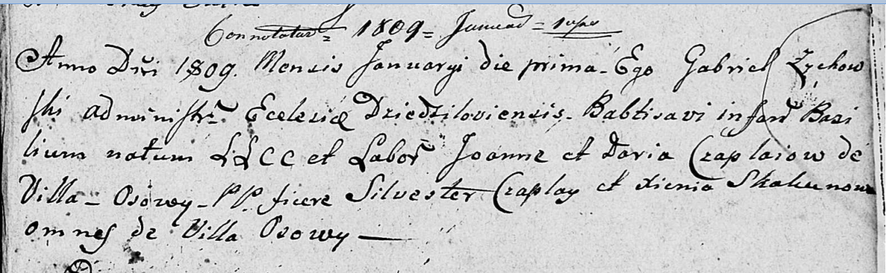

**Скакун Базыль Демьянов (Skakun Bazyli)**

16 сентября 1800 г -- крещение (НИАБ 136-13-894, лист 42, №25/1800-р
(ориг), НИАБ 136-13-949, лист 103об, №28/1800-р (коп)).

**НИАБ 136-13-894:** Лист 42. **Метрическая запись №25/1800-р (ориг).**

{width="6.496527777777778in"
height="1.7386209536307962in"}

Дедиловичская Покровская церковь. 16 сентября 1800 года. Метрическая
запись о крещении.

Skakun Bazyli -- сын родителей с деревни Осовo.

Skakun Dziemjan -- отец.

Skakunowa Xienia -- мать.

Kowal Daniło -- кум.

Kowalowa Zynowija -- кума.

Jazgunowicz Antoni -- ксёндз.

**НИАБ 136-13-949:** Лист 103об. **Метрическая запись №28/1800-р
(коп).**

(См. тж.: НИАБ 136-13-894, лист 42, №25/1800-р (ориг))

{width="6.496527777777778in"
height="1.148611111111111in"}

Дедиловичская Покровская церковь. 16 сентября 1800 года. Метрическая
запись о крещении.

Skakun Bazyli Jozefat -- сын родителей с деревни Осово.

Skakun Dziemjan -- отец.

Skakunowa Xienia -- мать.

Kowal Daniło -- кум, с деревни Осово.

Kowalowa Zynowia - кума, с деревни Осово.

Jazgunowicz Antoni -- ксёндз.
