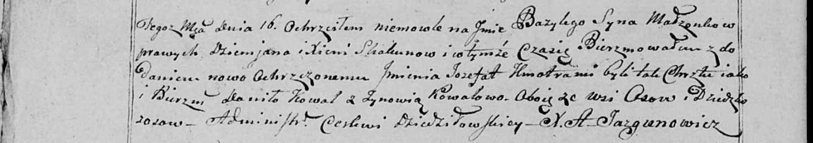

**Скакун Демьян (Skakun Dziemjan)**

27 октября 1795 г -- венчание с Ксеней Кикило с деревни Осово (НИАБ
136-13-920, лист 2, №6/1795-б (ориг)).

16 сентября 1800 г -- крещение сына Базыля (НИАБ 136-13-894, лист 42,
№25/1800-р (ориг), НИАБ 136-13-949, лист 103об, №28/1800-р (коп)).

17 мая 1803 г -- крещение дочери Елены Ксени (НИАБ 136-13-894, лист
50об, №22/1803-р (ориг)).

19 ноября 1805 г -- крещение сына Филипа Яна (НИАБ 136-13-894, лист 58,
№53/1805-р (ориг)).

28 августа 1810 г -- крещение сына Иосифа (НИАБ 136-13-894, лист 78об,
№35/1810-р (ориг)).

2 марта 1813 г -- отпевание, умер в возрасте 60 лет (родился около 1853
г) (НИАБ 136-13-919, лист 25об, №14/1813-у (ориг)).

**НИАБ 136-13-920:** Лист 2. **Метрическая запись №6/1795-б (ориг).**

{width="6.496527777777778in"
height="2.109410542432196in"}

Дедиловичская Покровская я церковь. 27 октября 1795 года. Метрическая
запись о венчании.

Skakun Dziamjan -- жених, с деревни Осово.

Kikiłowna Xienia -- невеста, девка, с деревни Осово.

Skakun Sider -- свидетель, с деревни Осово.

Audziuchowicz Leon -- свидетель, деревня Замосточье.

Jazgunowicz Antoni -- ксёндз.

**НИАБ 136-13-894:** Лист 42. **Метрическая запись №25/1800-р (ориг).**

{width="6.496527777777778in"
height="1.7386209536307962in"}

Дедиловичская Покровская церковь. 16 сентября 1800 года. Метрическая
запись о крещении.

Skakun Bazyli -- сын родителей с деревни Осовo.

Skakun Dziemjan -- отец.

Skakunowa Xienia -- мать.

Kowal Daniło -- кум.

Kowalowa Zynowija -- кума.

Jazgunowicz Antoni -- ксёндз.

**НИАБ 136-13-949:** Лист 103об. **Метрическая запись №28/1800-р
(коп).**

(См. тж.: НИАБ 136-13-894, лист 42, №25/1800-р (ориг))

{width="6.496527777777778in"
height="1.148611111111111in"}

Дедиловичская Покровская церковь. 16 сентября 1800 года. Метрическая
запись о крещении.

Skakun Bazyli Jozefat -- сын родителей с деревни Осово.

Skakun Dziemjan -- отец.

Skakunowa Xienia -- мать.

Kowal Daniło -- кум, с деревни Осово.

Kowalowa Zynowia - кума, с деревни Осово.

Jazgunowicz Antoni -- ксёндз.

**НИАБ 136-13-894:** Лист 50об. **Метрическая запись №22/1803-р
(ориг).**

{width="6.496527777777778in"
height="1.5388101487314085in"}

Дедиловичская Покровская церковь. 17 мая 1803 года. Метрическая запись о
крещении.

Skakunowna Elena Xienia -- дочь родителей с деревни Осовo.

Skakun Dziemjan -- отец.

Skakunowa Xienia -- мать.

Kowal Daniło -- кум.

Kowalowa Zynowija -- кума.

Jazgunowicz Antoni -- ксёндз.

**НИАБ 136-13-894:** Лист 58. **Метрическая запись №53/1805-р (ориг).**

{width="6.496527777777778in"
height="1.0003937007874015in"}

Дедиловичская Покровская церковь. 19 ноября 1805 года. Метрическая
запись о крещении.

Skakun Filip Jan -- сын родителей с деревни Осовo.

Skakun Dziemjan -- отец.

Skakunowa Xienia -- мать.

Kowal Daniło -- кум.

Kowalowna Ewdokija -- кума.

Jazgunowicz Antoni -- ксёндз.

**НИАБ 136-13-894:** Лист 78об. **Метрическая запись №35/1810-р
(ориг).**

{width="6.496527777777778in"
height="1.6279877515310586in"}

Осовская Покровская церковь. 28 августа 1810 года. Метрическая запись о
крещении.

Skakun Jozef -- сын родителей с деревни Осовo.

Skakun Dziemjan -- отец.

Skakunowa Axinia -- мать.

Kawal Charyton -- кум.

Kawalowna Zofia -- кума.

Woyniewicz Tomasz -- ксёндз.

**НИАБ 136-13-919:** Лист 25об. **Метрическая запись №14/1813-у
(ориг).**

{width="6.496527777777778in"
height="1.051388888888889in"}

Осовская униатская церковь. 2 марта 1813 года. Метрическая запись об
отпевании.

Skakun Dziemian -- умерший, 60 лет, с деревни Осово, похоронен на
кладбище деревни Осово.

Woyniewicz Tomasz -- ксёндз.
