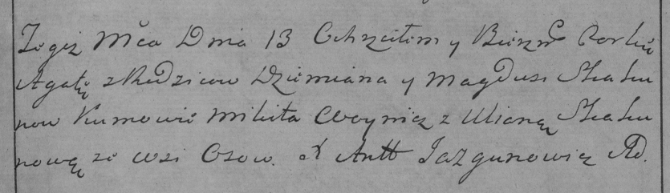

**Скакун Агата Демьянова (Skakunowna Agata)**

13 апреля 1785 г -- крещение (РГИА 823-2-18, лист 229, №11/1785-р
(коп)).

**РГИА 823-2-18:** Лист 229. **Метрическая запись №11/1785-р (коп).**

{width="6.496527777777778in"
height="1.875in"}

Дедиловичская Покровская церковь. 13 апреля 1785 года. Метрическая
запись о крещении.

Skakunowa Agata -- дочь родителей с деревни Осово.

Skakun Dziemian -- отец.

Skakunowa Magdusia -- мать.

Woynicz Mikita -- кум.

Skakunowa Uliana - кума.

Jazgunowicz Antoni -- ксёндз.
