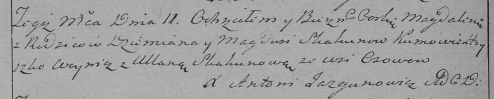

**Скакун Магдуся (Skakunowa Magdusia)**

13 апреля 1785 г -- крещение дочери Агаты (РГИА 823-2-18, лист 229,
№11/1785-р (коп)).

11 августа 1790 г -- крещение дочери Магдалены (НИАБ 136-13-894, лист
10об, №57/1790-р (ориг)), (РГИА 823-2-18, лист 240об, №22/1790-р (коп)).

**РГИА 823-2-18:** Лист 229. **Метрическая запись №11/1785-р (коп).**

{width="6.496527777777778in"
height="1.875in"}

Дедиловичская Покровская церковь. 13 апреля 1785 года. Метрическая
запись о крещении.

Skakunowa Agata -- дочь родителей с деревни Осово.

Skakun Dziemian -- отец.

Skakunowa Magdusia -- мать.

Woynicz Mikita -- кум.

Skakunowa Uliana - кума.

Jazgunowicz Antoni -- ксёндз.

**НИАБ 136-13-894:** Лист 10об. **Метрическая запись №57/1790-р
(ориг).**

{width="6.496527777777778in"
height="0.9299912510936132in"}

Дедиловичская Покровская церковь. 11 августа 1790 года. Метрическая
запись о крещении.

Skakunowna Magdalena -- дочь родителей с деревни Осово.

Skakun Dziemjan -- отец.

Skakunowa Magdusia -- мать.

Woynicz Hryszko - кум.

Skakunowa Ullana - кума.

Jazgunowicz Antoni -- ксёндз.

**РГИА 823-2-18:** Лист 240об. **Метрическая запись №22/1790-р (коп).**

{width="6.496527777777778in"
height="1.3006944444444444in"}

Дедиловичская Покровская церковь. 11 августа 1790 года. Метрическая
запись о крещении.

Skakunowna Magdalena -- дочь родителей с деревни Осово.

Skakun Dziemian -- отец.

Skakunowa Magdusia -- мать.

Woynicz Hryszko -- кум.

Skakunowa Ullana - кума.

Jazgunowicz Antoni -- ксёндз.
