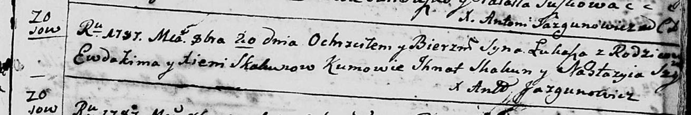
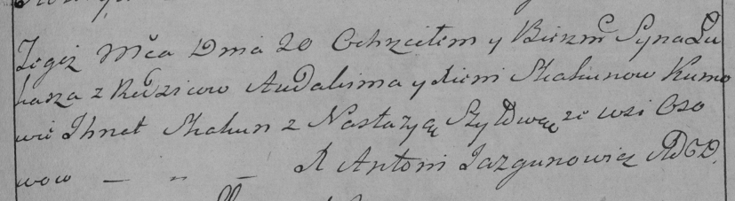

**Скакун Евдоким (Skakun Ewdokim, Audakim)**

20 октября 1787 г -- крещение сына Луки (НИАБ 136-13-894, лист 3,
№54/1787-р (ориг)), (РГИА 823-2-18, лист 235, №29/1787-р (коп)).

23 марта 1789 г -- крещение дочери Анны (НИАБ 136-13-894, лист 6об,
№22/1789-р (ориг)).

**НИАБ 136-13-894:** Лист 3. **Метрическая запись №54/1787-р (ориг).**

Дедиловичская Покровская церковь. 20 октября 1787 года. Метрическая
запись о крещении.

Skakun Łukasz -- сын родителей с деревни Осово.

Skakun Ewdokim -- отец.

Skakunowa Xienia -- мать.

Skakun Jhnat - кум.

Szyłowa Nastazyia - кума.

Jazgunowicz Antoni -- ксёндз.

**РГИА 823-2-18:** Лист 235. **Метрическая запись №29/1787-р (коп).**

Дедиловичская Покровская церковь. 20 октября 1787 года. Метрическая
запись о крещении.

Skakun Łukasz -- сын родителей с деревни Осово.

Skakun Audakim -- отец.

Skakunowa Xienia -- мать.

Skakun Jhnat -- кум.

Szyłowa Nastazya - кума.

Jazgunowicz Antoni -- ксёндз.

**НИАБ 136-13-894:** Лист 6об. **Метрическая запись №22/1789-р (ориг).**

Дедиловичская Покровская церковь. 23 марта 1789 года. Метрическая запись
о крещении.

Skakunowna Anna -- дочь родителей с деревни Осово.

Skakun Audakim -- отец.

Skakunowa Xienia -- мать.

Skakun ? - кум.

Fastowiczowna Jedwiga - кума.

Jazgunowicz Antoni -- ксёндз.
