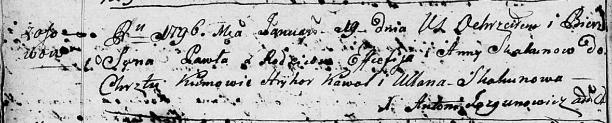

**Скакун Павел Евсеев (Skakun Paweł)**

19 января 1796 г -- крещение (НИАБ 136-13-894, лист 27об, №8/1796-р
(ориг)).

**НИАБ 136-13-894:** Лист 27об. **Метрическая запись №8/1796-р (ориг).**

{width="6.496527777777778in"
height="1.3061450131233596in"}

Дедиловичская Покровская церковь. 19 января 1796 года. Метрическая
запись о крещении.

Skakun Paweł -- сын родителей с деревни Осовo.

Skakun Efciefij -- отец.

Skakunowa Anna -- мать.

Kawal Hryhory - кум.

Skakunowa Ullana - кума.

Jazgunowicz Antoni -- ксёндз.
