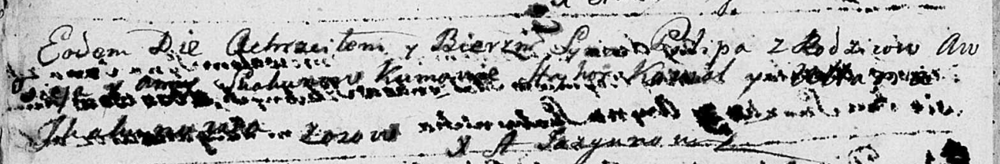

**Скакун Пилип Евсеев (Skakun Pilip)**

26 октября 1790 г -- крещение (НИАБ 136-13-894, лист 11об, №77/1790-р
(ориг)).

**НИАБ 136-13-894:** Лист 11об. **Метрическая запись №77/1790-р
(ориг).**

Дедиловичская Покровская церковь. 26 октября 1790 года. Метрическая
запись о крещении.

Skakun Pilip -- сын родителей с деревни Осово.

Skakun Awsiej -- отец.

Skakunowa Anna -- мать.

Kawal Hryhor - кум.

Skakunowa Ullana - кума.

Jazgunowicz Antoni -- ксёндз.
