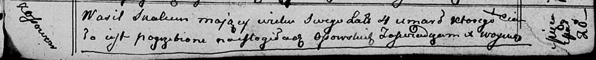

**Скакун Василь Иосифов (Skakun Wasil)**

22 февраля 1810 г -- крещение (НИАБ 136-13-894, лист 77, №10/1810-р
(ориг)).

20 марта 1813 г -- отпевание, умер в возрасте 4 лет (НИАБ 136-13-919,
лист 26, №27/1813-у (ориг)).

**НИАБ 136-13-894:** Лист 77. **Метрическая запись №10/1810-р (ориг).**

{width="6.496527777777778in"
height="1.3416819772528434in"}

Дедиловичская Покровская церковь. 22 февраля 1810 года. Метрическая
запись о крещении.

Skakun Wasil -- сын родителей с деревни Осовo.

Skakun Jozef -- отец.

Skakunowa Ewdokija -- мать.

Axiuta Andrzey -- кум.

Skakunowa Marya -- кума.

Jazgunowicz Antoni -- ксёндз.

**НИАБ 136-13-919:** Лист 26. **Метрическая запись №27/1813-у (ориг).**

{width="6.496527777777778in"
height="0.6569444444444444in"}

Осовская униатская церковь. 20 марта 1813 года. Метрическая запись об
отпевании.

Skakun Wasil -- умерший, 4 года, с деревни Осово, похоронен на кладбище
деревни Осово.

Woyniewicz Tomasz -- ксёндз.
