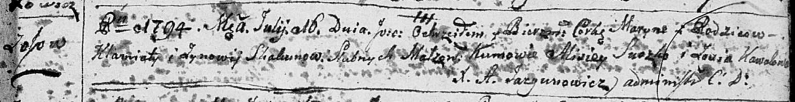

**Скакун (Коваль) Зыновия (Skakunowa Zynowija z Kawalow)**

27 октября 1790 г -- венчание с Клямятой Скакунов с деревни Осово (НИАБ
136-13-894, лист 68об, №8/1790-б (ориг)).

20 ноября 1791 г -- крещение сына Якуба (НИАБ 136-13-894, лист 14об,
№60/1791-р (ориг)).

16 июля 1794 г -- крещение дочери Марыны (НИАБ 136-13-894, лист 22,
№27/1794-р (ориг)), (РГИА 823-2-18, лист 250, №18/1794-р (коп)).

20 июня 1798 г -- крещение сына Луки (НИАБ 136-13-894, лист 36,
№26/1798-р (ориг)), (РГИА 823-2-18, лист 264, №26/1798-р (коп)).

1 января 1800 г -- возможно, крестная мать Базылия, сына Чапляев
Цимахвея и Евдокии с деревни Осово (НИАБ 136-13-894, лист 40, №1/1800-р
(ориг)).

21 августа 1804 г -- возможно, крестная мать Паланеи Агаты, дочери Кикил
Андрея и Паланеи с деревни Осово (НИАБ 136-13-894, лист 54об, №30/1804-р
(ориг)).

13 июня 1807 г -- возможно, крестная мать Магдалены Марьяны, дочери
Кикил Андрея и Паланеи с деревни Осово (НИАБ 136-13-894, лист 63,
№30/1807-р (ориг)).

10 июня 1807 г -- возможно, крестная мать Марыи, дочери Скакунов Степана
и Авхинии с деревни Осово (НИАБ 136-13-893, лист 63, №31/1807-р (ориг)).

**НИАБ 136-13-894:** Лист 68об. **Метрическая запись №8/1790-б (ориг).**

{width="6.496527777777778in"
height="1.107004593175853in"}

Дедиловичская Покровская церковь. 27 октября 1790 года. Метрическая
запись о венчании.

Skakun Klamiata -- жених, с деревни Осовo.

Kawalowna Zynowija -- невеста.

Browka Paweł -- свидетель.

Woynicz Macwiey -- свидетель.

Woynicz Leon -- свидетель.

Jazgunowicz Antoni -- ксёндз.

**НИАБ 136-13-894:** Лист 14-об. **Метрическая запись №60/1791-р
(ориг).**

{width="6.496527777777778in"
height="0.8213692038495188in"}

Дедиловичская Покровская церковь. 20 ноября 1791 года. Метрическая
запись о крещении.

Skakun Jakub -- родителей с деревни Осовo.

Skakun Klamiata -- отец.

Skakunowa Zynowija -- мать.

Suszko Alisiey - кум.

Kowalowa Zofija - кума.

Jazgunowicz Antoni -- ксёндз.

**НИАБ 136-13-894:** Лист 22. **Метрическая запись №27/1794-р (ориг).**

{width="6.496527777777778in"
height="0.8441666666666666in"}

Дедиловичская Покровская церковь. 16 июля 1794 года. Метрическая запись
о крещении.

Skakunowna Maryna -- дочь родителей с деревни Осовo.

Skakun Klamiata -- отец.

Skakunowa Zynowija -- мать.

Suszko Alisiey - кум.

Kowalowa Zosia - кума.

Jazgunowicz Antoni -- ксёндз.

**РГИА 823-2-18:** Лист 250. **Метрическая запись №18/1794-р (коп).**

{width="6.496527777777778in"
height="1.4708333333333334in"}

Дедиловичская Покровская церковь. 16 июля 1794 года. Метрическая запись
о крещении.

Skakunowna Maryna -- дочь родителей с деревни Осово.

Skakun Klemiata -- отец.

Skakunowa Zynowija -- мать.

Suszko Alisiey -- кум.

Kowalowa Zosia -- кума.

Jazgunowicz Antoni -- ксёндз.

**НИАБ 136-13-894:** Лист 36. **Метрическая запись №26/1798-р (ориг).**

{width="6.496527777777778in"
height="1.0433070866141732in"}

Дедиловичская Покровская церковь. 20 июня 1798 года. Метрическая запись
о крещении.

Skakun Łukasz -- сын родителей с деревни Осовo.

Skakun Klemens -- отец.

Skakunowa Zynowija -- мать.

Suszko Alixiey - кум.

Kawalowa Zosia - кума.

Jazgunowicz Antoni -- ксёндз.

**РГИА 823-2-18:** Лист 264. **Метрическая запись №26/1798-р (коп).**

{width="6.496527777777778in"
height="1.3388888888888888in"}

Дедиловичская Покровская церковь. 20 июня 1798 года. Метрическая запись
о крещении.

Skakun Łukasz -- сын \[родителей с деревни Осовo\].

Skakun Klemens -- отец.

Skakunowa Zenowija -- мать.

Suszko Alaxiey -- кум.

Kowalowa Zosia -- кума.

Jazgunowicz Antoni -- ксёндз.

**НИАБ 136-13-894:** Лист 40. **Метрическая запись №1/1800-р (ориг).**

{width="6.496527777777778in"
height="1.0862193788276466in"}

Дедиловичская Покровская церковь. 1 января 1800 года. Метрическая запись
о крещении.

Czaplay Bazyli -- сын родителей с деревни Осовo.

Czaplay Cimachwiey -- отец.

Czaplaiowa Ewdokija -- мать.

Skakun Chwiedor -- кум, с деревни Замосточье.

Skakunowa Zynowija -- кума, с деревни Осовo.

Jazgunowicz Antoni -- ксёндз.

**НИАБ 136-13-894:** Лист 54об. **Метрическая запись №30/1804-р
(ориг).**

{width="6.496527777777778in"
height="1.4791349518810148in"}

Дедиловичская Покровская церковь. 21 августа 1804 года. Метрическая
запись о крещении.

Kikiłowna Pałanieja Agata -- дочь родителей с деревни Осовo.

Kikiło Andrzey -- отец.

Kikiłowa Pałanieja -- мать.

Skakun Sawasciey -- кум, с деревни Осовo.

Skakunowa Zynowija -- кума, с деревни Осовo.

Jazgunowicz Antoni -- ксёндз.

**НИАБ 136-13-894:** Лист 63. **Метрическая запись №30/1807-р (ориг).**

{width="6.496527777777778in"
height="1.775498687664042in"}

Дедиловичская Покровская церковь. 13 июня 1807 года. Метрическая запись
о крещении.

Kikiłowna Magdalena Marjana -- дочь родителей с деревни Осовo.

Kikiło Andrey -- отец.

Kikiłowa Pałanieja -- мать.

Skakun Sawasciey -- кум, с деревни Осовo.

Skakunicha Zynowija -- кума, с деревни Осовo.

Jazgunowicz Antoni -- ксёндз.

**НИАБ 136-13-894:** Лист 63. **Метрическая запись №31/1807-р (ориг).**

{width="6.496527777777778in"
height="1.6360334645669292in"}

Дедиловичская Покровская церковь. 10 июня 1807 года. Метрическая запись
о крещении.

Skakunowna Marya -- дочь родителей с деревни Осовo.

Skakun Sciepan -- отец.

Skakunowa Auchinia -- мать.

Skakun Kuźma -- кум, с деревни Осовo.

Skakunowa Zynowia -- кума, с деревн Осовo.

Jazgunowicz Antoni -- ксёндз.
