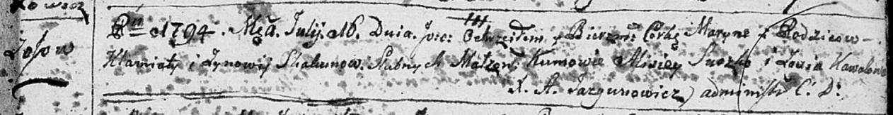

**Скакун Клямята (Skakun Klamiata, Klemens)**

27 октября 1790 г -- венчание с Зыновией Каваль (НИАБ 136-13-894, лист
68об, №8/1790-б (ориг)).

20 ноября 1791 г -- крещение сына Якуба (НИАБ 136-13-894, лист 14об,
№60/1791-р (ориг)).

16 июля 1794 г -- крещение дочери Марыны (НИАБ 136-13-894, лист 22,
№27/1794-р (ориг)), (РГИА 823-2-18, лист 250, №18/1794-р (коп)).

20 июня 1798 г -- крещение сына Луки (НИАБ 136-13-894, лист 36,
№26/1798-р (ориг)), (РГИА 823-2-18, лист 264, №26/1798-р (коп)).

11 сентября 1799 г -- крестный отец Сымона Павла, сына Сушков Игната и
Паланеи с деревни Осово (НИАБ 136-13-894, лист 39об, №35/1799-р (ориг)).

24 февраля 1803 г -- крестный отец Анны Евы, дочери Дударёнков Иосифа и
Палюхи с деревни Осово (НИАБ 136-13-894, лист 49об, №7/1803-р (ориг)).

16 декабря 1806 г -- крестный отец Данилы Себестыана, дочери Дударёнков
Иосифа и Палюхи с деревни Осово (НИАБ 136-13-894, лист 61об, №52/1806-р
(ориг)).

6 ноября 1807 г -- свидетель венчания молодого Грыгора Сушко с деревни
Осово с девкой Анной Коваль с деревни Осово (НИАБ 136-13-920, лист 13,
№9/1807-б (ориг)).

**НИАБ 136-13-894:** Лист 68об. **Метрическая запись №8/1790-б (ориг).**

{width="6.496527777777778in"
height="1.107004593175853in"}

Дедиловичская Покровская церковь. 27 октября 1790 года. Метрическая
запись о венчании.

Skakun Klamiata -- жених, с деревни Осовo.

Kawalowna Zynowija -- невеста.

Browka Paweł -- свидетель.

Woynicz Macwiey -- свидетель.

Woynicz Leon -- свидетель.

Jazgunowicz Antoni -- ксёндз.

**НИАБ 136-13-894:** Лист 14-об. **Метрическая запись №60/1791-р
(ориг).**

{width="6.496527777777778in"
height="0.8213692038495188in"}

Дедиловичская Покровская церковь. 20 ноября 1791 года. Метрическая
запись о крещении.

Skakun Jakub -- родителей с деревни Осовo.

Skakun Klamiata -- отец.

Skakunowa Zynowija -- мать.

Suszko Alisiey - кум.

Kowalowa Zofija - кума.

Jazgunowicz Antoni -- ксёндз.

**НИАБ 136-13-894:** Лист 22. **Метрическая запись №27/1794-р (ориг).**

{width="6.496527777777778in"
height="0.8441666666666666in"}

Дедиловичская Покровская церковь. 16 июля 1794 года. Метрическая запись
о крещении.

Skakunowna Maryna -- дочь родителей с деревни Осовo.

Skakun Klamiata -- отец.

Skakunowa Zynowija -- мать.

Suszko Alisiey - кум.

Kowalowa Zosia - кума.

Jazgunowicz Antoni -- ксёндз.

**РГИА 823-2-18:** Лист 250. **Метрическая запись №18/1794-р (коп).**

{width="6.496527777777778in"
height="1.4708333333333334in"}

Дедиловичская Покровская церковь. 16 июля 1794 года. Метрическая запись
о крещении.

Skakunowna Maryna -- дочь родителей с деревни Осово.

Skakun Klemiata -- отец.

Skakunowa Zynowija -- мать.

Suszko Alisiey -- кум.

Kowalowa Zosia -- кума.

Jazgunowicz Antoni -- ксёндз.

**НИАБ 136-13-894:** Лист 36. **Метрическая запись №26/1798-р (ориг).**

{width="6.496527777777778in"
height="1.0433070866141732in"}

Дедиловичская Покровская церковь. 20 июня 1798 года. Метрическая запись
о крещении.

Skakun Łukasz -- сын родителей с деревни Осовo.

Skakun Klemens -- отец.

Skakunowa Zynowija -- мать.

Suszko Alixiey - кум.

Kawalowa Zosia - кума.

Jazgunowicz Antoni -- ксёндз.

**РГИА 823-2-18:** Лист 264. **Метрическая запись №26/1798-р (коп).**

{width="6.496527777777778in"
height="1.3388888888888888in"}

Дедиловичская Покровская церковь. 20 июня 1798 года. Метрическая запись
о крещении.

Skakun Łukasz -- сын \[родителей с деревни Осовo\].

Skakun Klemens -- отец.

Skakunowa Zenowija -- мать.

Suszko Alaxiey -- кум.

Kowalowa Zosia -- кума.

Jazgunowicz Antoni -- ксёндз.

**НИАБ 136-13-894:** Лист 39об. **Метрическая запись №35/1799-р
(ориг).**

{width="6.496527777777778in"
height="1.236411854768154in"}

Дедиловичская Покровская церковь. 11 сентября 1799 года. Метрическая
запись о крещении.

Suszko Symon Paweł -- сын родителей с деревни Осовo.

Suszko Jgnacy -- отец.

Suszkowa Pałanieja -- мать.

Skakun Klamiata -- кум, с деревни Осово.

Kowalowa Ahafia -- кума, с деревни Осово.

Jazgunowicz Antoni -- ксёндз.

**НИАБ 136-13-894:** Лист 49об. **Метрическая запись №7/1803-р (ориг).**

{width="6.496527777777778in"
height="1.2719488188976378in"}

Дедиловичская Покровская церковь. 24 февраля 1803 года. Метрическая
запись о крещении.

Dudaronkowna Anna Ewa -- дочь родителей с деревни Осово.

Dudaronek Jozef -- отец.

Dudaronkowa Palucha -- мать.

Skakun Klamiato -- кум, с деревни Осово.

Skakunowa Ewdokija -- кума, с деревни Осово.

Jazgunowicz Antoni -- ксёндз.

**НИАБ 136-13-894:** Лист 61об. **Метрическая запись №52/1806-р
(ориг).**

{width="6.496527777777778in"
height="1.092253937007874in"}

Дедиловичская Покровская церковь. 16 декабря 1806 года. Метрическая
запись о крещении.

Dudaronek Daniło Sebestyan -- сын родителей с деревни Замосточье.

Dudaronek Jozef -- отец.

Dudaronkowa Pałanieja -- мать.

Skakun Klamiata -- кум, с деревни Осовo.

Skakunowa Ewdokia -- кума, с деревни Осовo.

Jazgunowicz Antoni -- ксёндз.

**НИАБ 136-13-920:** Лист 13. **Метрическая запись №9/1807-б (ориг).**

{width="6.496527777777778in"
height="2.5103729221347333in"}

Дедиловичская Покровская церковь. 6 ноября 1807 года. Метрическая запись
о венчании.

Szuszko Hryhor -- жених, молодой, с деревни Осовo.

Kowalowa Anna -- невеста, девка, с деревни Осовo.

Skakun Klamiata -- свидетель, с деревни Осовo.

Kowal Anton -- свидетель, с деревни Осовo.

Jazgunowicz Antoni -- ксёндз.
