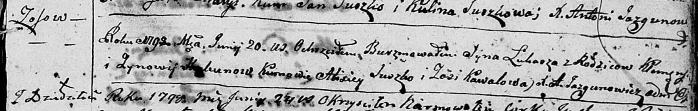

**Скакун Лука Клямятов (Skakun Łukasz)**

20 июня 1798 г -- крещение (НИАБ 136-13-894, лист 36, №26/1798-р
(ориг)), (РГИА 823-2-18, лист 264, №26/1798-р (коп)).

**НИАБ 136-13-894:** Лист 36. **Метрическая запись №26/1798-р (ориг).**

Дедиловичская Покровская церковь. 20 июня 1798 года. Метрическая запись
о крещении.

Skakun Łukasz -- сын родителей с деревни Осовo.

Skakun Klemens -- отец.

Skakunowa Zynowija -- мать.

Suszko Alixiey - кум.

Kawalowa Zosia - кума.

Jazgunowicz Antoni -- ксёндз.

**НИАБ 136-13-894:** Лист 36. **Метрическая запись №26/1798-р (ориг).**

Дедиловичская Покровская церковь. 20 июня 1798 года. Метрическая запись
о крещении.

Skakun Łukasz -- сын родителей с деревни Осовo.

Skakun Klemens -- отец.

Skakunowa Zynowija -- мать.

Suszko Alixiey - кум.

Kawalowa Zosia - кума.

Jazgunowicz Antoni -- ксёндз.
