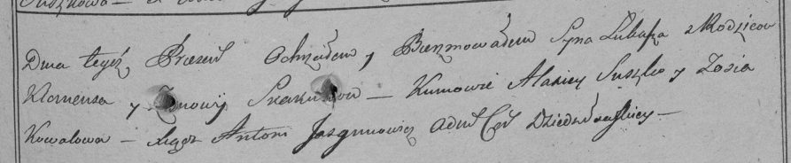

**Скакун Якуб Клямятов (Skakun Jakub)**

20 ноября 1791 г -- крещение (НИАБ 136-13-894, лист 14об, №60/1791-р
(ориг)).

**НИАБ 136-13-894:** Лист 14-об. **Метрическая запись №60/1791-р
(ориг).**

{width="6.496527777777778in"
height="0.8213692038495188in"}

Дедиловичская Покровская церковь. 20 ноября 1791 года. Метрическая
запись о крещении.

Skakun Jakub -- родителей с деревни Осовo.

Skakun Klamiata -- отец.

Skakunowa Zynowija -- мать.

Suszko Alisiey - кум.

Kowalowa Zofija - кума.

Jazgunowicz Antoni -- ксёндз.
