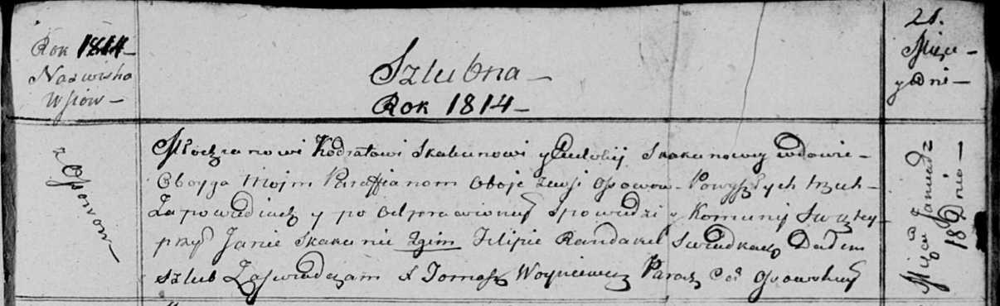

**Скакун Кондрат (Skakun Kondrat)**

18 января 1814 г -- венчание с вдовой Евдокией Скакун с деревни Осово
(НИАБ 136-13-920, лист 21, №1/1814-б (ориг)).

**НИАБ 136-13-920:** Лист 21. **Метрическая запись №1/1814-б (ориг).**

Осовская Покровская церковь. 18 января 1814 года. Запись о венчании.

Skakun Kodrat -- жених, молодой, парафии Осовской, с деревни Осово.

Skakunowa Eudokija -- невеста, вдова, парафии Осовской, с деревни Осово.

Skakun Jan -- свидетель.

Randak Filip -- свидетель.

Woyniewicz Tomasz -- ксёндз.

**НИАБ 136-13-894:** Лист 97об. **Метрическая запись №60/1817-р
(ориг).**

Осовская Покровская церковь. 5 октября 1817 года. Метрическая запись о
крещении.

Skakunowna Jadwiga -- дочь родителей с деревни Осовo.

Skakun Kondrat -- отец.

Skakunowa Eudokija -- мать.

Łapiec Audakim -- кум.

Skakunowa Marta -- кума.

Woyniewicz Tomasz -- ксёндз.
