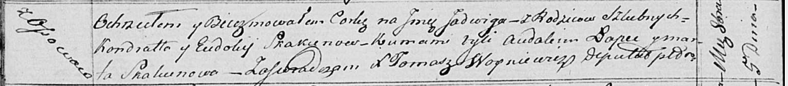

**Скакун Ядвига Кондратова (Skakunowna Jadwiga)**

5 октября 1817 г -- крещение (НИАБ 136-13-893, лист 97об, №60/1817-р
(ориг)).

**НИАБ 136-13-894:** Лист 97об. **Метрическая запись №60/1817-р
(ориг).**

{width="6.496527777777778in"
height="0.7187817147856518in"}

Осовская Покровская церковь. 5 октября 1817 года. Метрическая запись о
крещении.

Skakunowna Jadwiga -- дочь родителей с деревни Осовo.

Skakun Kondrat -- отец.

Skakunowa Eudokija -- мать.

Łapiec Audakim -- кум.

Skakunowa Marta -- кума.

Woyniewicz Tomasz -- ксёндз.
