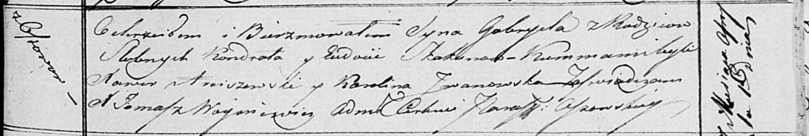

**Скакун Габриэль Кондратов (Skakun Gabriel)**

1 апреля 1817 г -- крещение (НИАБ 136-13-894, лист 6, №24/1817-р
(ориг)).

**НИАБ 136-13-894:** 96. **Метрическая запись №24/1817-р (ориг).**

Осовская Покровская церковь. 1 апреля 1817 года. Метрическая запись о
крещении.

Skakun Gabriel -- сын родителей с деревни Осовo.

Skakun Kondrat -- отец.

Skakunowa Eudokija -- мать.

Arciszewski Xawier -- кум.

Jwanowska Karolina -- кума.

Woyniewicz Tomasz -- ксёндз.
