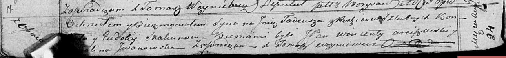

**Скакун Тадей Кондратов (Skakun Tadeusz)**

24 августа 1819 г -- крещение (НИАБ 136-13-894, лист 101об, №47/1819-р
(ориг)).

**НИАБ 136-13-894:** Лист 101об. **Метрическая запись №47/1819-р
(ориг).**

{width="6.496527777777778in"
height="0.7596828521434821in"}

Осовская Покровская церковь. 24 августа 1819 года. Метрическая запись о
крещении.

Skakun Tadeusz -- сын родителей с деревни Осовo.

Skakun Kondrat -- отец.

Skakunowa Eudokija -- мать.

Arciszewski Wincenty, JP -- кум, шляхтич.

Jwanоwska ...lina -- кума.

Woyniewicz Tomasz -- ксёндз.
