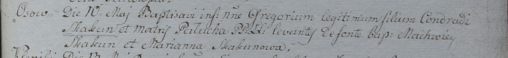

**Скакун Грегор Кондратов (Skakun Gregor)**

10 мая 1798 г -- крещение сына Грегора (НИАБ 1781-27-199, лист 122,
№2/1798-р).

**НИАБ 1781-27-199:** Лист 122. **Метрическая запись №2/1798-р.**

Дедиловичский костел Наисвятейшего Сердца Иисуса. 10 мая 1798 года.
Метрическая запись о крещении.

Skakun Gregorium -- сын крестьян с деревни Осово.

Skakun Conrad -- отец.

Skakunowa Palucha -- мать.

Skakun Machwiey -- крестный отец.

Skakunowa Marianna - крестная мать.

Linhart Hyacinthus -- ксёндз.
