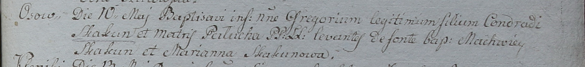

**Скакун (Лепёшко) Паланея (Skakunowa Pałanieja z Lapioszkow)**

30 мая 1792 г -- венчание с Кондратом Скакуном с деревни Осово (НИАБ
136-13-894, лист 70об, №8/1792-б (ориг)).

10 мая 1798 г -- крещение сына Грегора (НИАБ 1781-27-199, лист 122,
№2/1798-р).

20 января 1807 г -- крестный отец Стефана, сына Клясунов Гаврылы и Химы
с деревни Осово (НИАБ 136-13-894, лист 61об, №1/1807-р (ориг)).

**НИАБ 136-13-894:** Лист 70об. **Метрическая запись №8/1792-б (ориг).**

Дедиловичская Покровская церковь. 30 мая 1792 года. Метрическая запись о
венчании.

Skakun Kondrat -- жених, с деревни Осово.

Lapioszkowna Palanieja -- невеста.

Skakun Sydor -- свидетель.

Axiuta Andrzey -- свидетель.

Jazgunowicz Antoni -- ксёндз.

**НИАБ 1781-27-199:** Лист 122. **Метрическая запись №2/1798-р.**

Дедиловичский костел Наисвятейшего Сердца Иисуса. 10 мая 1798 года.
Метрическая запись о крещении.

Skakun Gregorium -- сын крестьян с деревни Осово.

Skakun Conrad -- отец.

Skakunowa Palucha -- мать.

Skakun Machwiey -- крестный отец.

Skakunowa Marianna - крестная мать.

Linhart Hyacinthus -- ксёндз.

**НИАБ 136-13-894:** Лист 61об. **Метрическая запись №1/1807-р (ориг).**

Дедиловичская Покровская церковь. 20 января 1807 года. Метрическая
запись о крещении.

Klasun Stefan -- сын родителей с деревни Осовo.

Klasun Hauryła -- отец.

Klasun Chima -- мать.

Skakun Kondrat -- кум, с деревни Осовo.

Skakunowa Nastazya -- кума, с деревни Осовo.

Jazgunowicz Antoni -- ксёндз.
