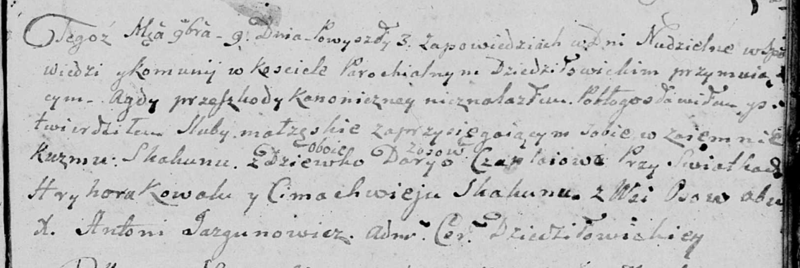

**Скакун (Чапляй) Дария (Skakunowa Darija z Czaplajow)**

9 ноября 1807 г -- венчание с Кузьмой Скакуном с деревни Осово (НИАБ
136-13-920, лист 13, №10/1807-б (ориг)).

21 ноября 1812 г -- крещение дочери Евы (НИАБ 136-13-894, лист 85об,
№53/1812-р (ориг)).

**НИАБ 136-13-920:** Лист 13. **Метрическая запись №10/1807-б (ориг).**

Дедиловичская Покровская церковь. 9 ноября 1807 года. Метрическая запись
о венчании.

Skakun Kuzma -- жених, с деревни Осовo.

Czaplaiowa Darya -- невеста, девка, с деревни Осовo.

Kowal Hryhor -- свидетель, с деревни Осовo.

Skakun Cimachwiey -- свидетель, с деревни Осовo.

Jazgunowicz Antoni -- ксёндз.

**НИАБ 136-13-894:** Лист 85об. **Метрическая запись №53/1812-р
(ориг).**

Осовская Покровская церковь. 21 ноября 1812 года. Метрическая запись о
крещении.

Skakunowa Ewa -- дочь родителей с деревни Осовo.

Skakun Kuźma -- отец.

Skakunowa Darija -- мать.

Skakun Jan -- кум.

Kowalowa Anna -- кума.

Woyniewicz Tomasz -- ксёндз.
