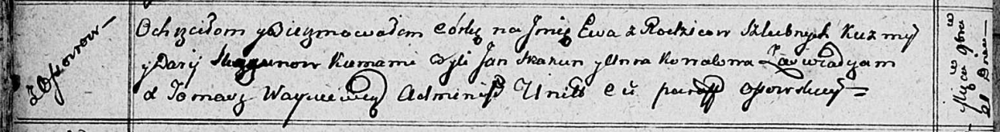

**Скакун Ева Кузьмова (Skakunowna Ewa)**

21 ноября 1812 г -- крещение (НИАБ 136-13-894, лист 85об, №53/1812-р
(ориг)).

**НИАБ 136-13-894:** Лист 85об. **Метрическая запись №53/1812-р
(ориг).**

{width="6.496527777777778in"
height="0.860929571303587in"}

Осовская Покровская церковь. 21 ноября 1812 года. Метрическая запись о
крещении.

Skakunowa Ewa -- дочь родителей с деревни Осовo.

Skakun Kuźma -- отец.

Skakunowa Darija -- мать.

Skakun Jan -- кум.

Kowalowa Anna -- кума.

Woyniewicz Tomasz -- ксёндз.
