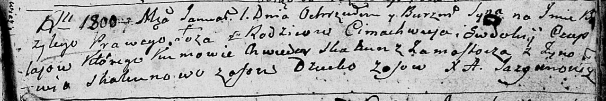

**Скакун Ларывон (Skakun Łarywon)**

10 февраля 1790 г -- крещение сына Марцина (НИАБ 136-13-894, лист 8об,
№11/1790-р (ориг)).

**НИАБ 136-13-894:** Лист 8об. **Метрическая запись №11/1790-р (ориг).**

{width="6.496527777777778in"
height="0.6443558617672791in"}

Дедиловичская Покровская церковь. 10 февраля 1790 года. Метрическая
запись о крещении.

Skakun Marcin -- сын родителей с деревни Осово.

Skakun Larywon -- отец.

Skakunowa Zienowia -- мать.

Każamiaka Dawid - кум.

Axiutowa Aryna - кума.

Jazgunowicz Antoni -- ксёндз.
