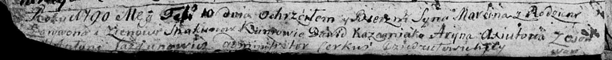

**Скакун Марцин Ларывонов (Skakun Marcin)**

10 февраля 1790 г -- крещение (НИАБ 136-13-894, лист 8об, №11/1790-р
(ориг)).

**НИАБ 136-13-894:** Лист 8об. **Метрическая запись №11/1790-р (ориг).**

Дедиловичская Покровская церковь. 10 февраля 1790 года. Метрическая
запись о крещении.

Skakun Marcin -- сын родителей с деревни Осово.

Skakun Larywon -- отец.

Skakunowa Zienowia -- мать.

Każamiaka Dawid - кум.

Axiutowa Aryna - кума.

Jazgunowicz Antoni -- ксёндз.
