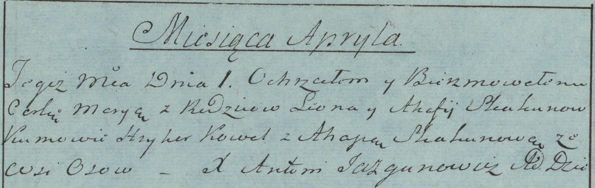

**Скакун Марыя Леонова (Skakun Marya)**

1 апреля 1784 г -- крещение (РГИА 823-2-18, лист 226об, №9/1784-р
(коп)).

**РГИА 823-2-18:** Лист 226об. **Метрическая запись №9/1784-р (коп).**

Дедиловичская Покровская церковь. 1 апреля 1784 года. Метрическая запись
о крещении.

Skakunowna Marya -- дочь родителей с деревни Осово.

Skakun Leon -- отец.

Skakunowa Ahafija -- мать.

Kowal Hryhor -- кум.

Skakunowa Ahapa - кума.

Jazgunowicz Antoni -- ксёндз.
