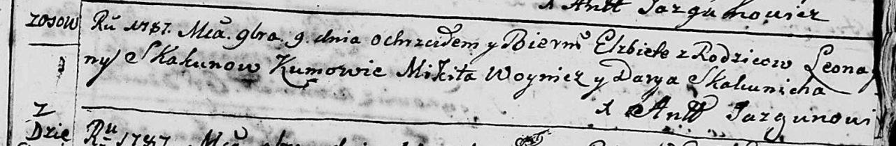
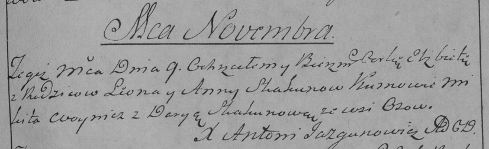

**Скакун Леон (Skakun Leon)**

9 ноября 1787 г -- крещение дочери Елисаветы (НИАБ 136-13-893, лист 3,
№56/1787-р (ориг)), РГИА 823-2-18, лист 235, №30/1787-р (коп)).

**НИАБ 136-13-894:** Лист 3. **Метрическая запись №56/1787-р (ориг).**

Дедиловичская Покровская церковь. 9 ноября 1787 года. Метрическая запись
о крещении.

Skakunowna Elżbieta -- дочь родителей с деревни Осово.

Skakun Leon -- отец.

Skakunowa ..na -- мать.

Woynicz Mikita - кум.

Skakunicha Darya - кума.

Jazgunowicz Antoni -- ксёндз.

**РГИА 823-2-18:** Лист 235. **Метрическая запись №30/1787-р (коп).**

Дедиловичская Покровская церковь. 9 ноября 1787 года. Метрическая запись
о крещении.

Skakunowna Elżbieta -- дочь родителей с деревни Осово.

Skakun Leon -- отец.

Skakunowa Anna -- мать.

Woynicz Mikita -- кум.

Skakunowa Darya - кума.

Jazgunowicz Antoni -- ксёндз.
