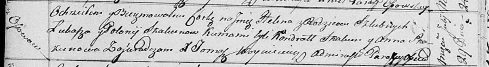

**Скакун Елена Лукашова (Skakunowna Helena)**

29 июля 1817 г -- крещение (НИАБ 136-13-894, лист 97, №47/1817-р
(ориг)).

**НИАБ 136-13-894:** Лист 97. **Метрическая запись №47/1817-р (ориг).**

Осовская Покровская церковь. 29 июля 1817 года. Метрическая запись о
крещении.

Skakunowna Helena -- дочь родителей с деревни Осовo.

Skakun Łukasz -- отец.

Skakunowa Połonija -- мать.

Skakun Kondrat -- кум.

Skakunowa Anna -- кума.

Woyniewicz Tomasz -- ксёндз.
