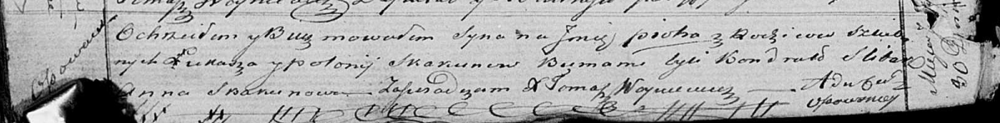

**Скакун Пётр Лукашов (Skakun Piotr)**

30 июля 1821 г -- крещение (НИАБ 136-13-894, лист 106об, №35/1821-р
(ориг)).

**НИАБ 136-13-894:** Лист 106об. **Метрическая запись №35/1821-р
(ориг).**

{width="6.496527777777778in"
height="0.8039359142607174in"}

Осовская Покровская церковь. 30 июля 1821 года. Метрическая запись о
крещении.

Skakun Piotr -- сын родителей с деревни Осовo.

Skakun Łukasz -- отец.

Skakunowa Połonia -- мать.

Slisar? Kondrat -- кум.

Skakunowa Anna -- кума.

Woyniewicz Tomasz -- ксёндз.
