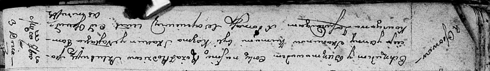

**Скакун Мацей (Skakun Maciey)**

3 сентября 1811 г -- крещение дочери Ружы (НИАБ 136-13-894, лист 81об,
№45/1811-р (ориг)).

**НИАБ 136-13-894:** Лист 81об. **Метрическая запись №45/1811-р
(ориг).**

Осовская Покровская церковь. 3 сентября 1811 года. Метрическая запись о
крещении.

Skakunowa Róża -- дочь родителей с деревни Осово.

Skakun Maciey -- отец.

Skakunowa Anna -- мать.

Skakun Kozma -- кум.

Tomkowiczowa Nastazya -- кума.

Woyniewicz Tomasz -- ксёндз.
