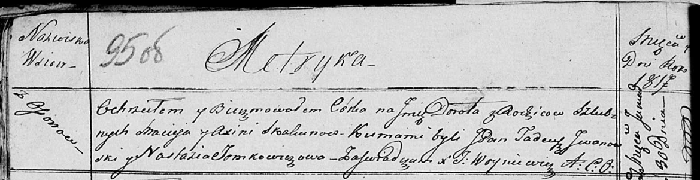

**Скакун Дорота Мацеева (Skakunowna Dorota)**

30 января 1817 г -- крещение (НИАБ 136-13-894, лист 95об, №7/1817-р
(ориг)).

**НИАБ 136-13-894:** Лист 95об. **Метрическая запись №7/1817-р (ориг).**

Осовская Покровская церковь. 30 января 1817 года. Метрическая запись о
крещении.

Skakunowna Dorota -- дочь родителей с деревни Осовo.

Skakun Maciey -- отец.

Skakunowa Axinia -- мать.

Jwanowski Tadeusz, JP -- кум, шляхтич.

Tomkowiczowa Nastazia -- кума.

Woyniewicz Tomasz -- ксёндз.
