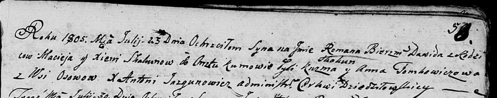

**Скакун Мацей (Skakun Maciey)**

7 октября 1792 г -- вероятно, свидетель при венчании Кастуся Цераха с
деревни Домашковичи с Агапой Лапец с деревни Осово (НИАБ 136-13-894,
лист 71, №16/1792-б (ориг)).

2 февраля 1805 г -- крестный отец Сымона Игнацыя, сына Скакунов Андрея и
Настасьи с деревни Осово (НИАБ 136-13-894, лист 56об, №14/1805-р
(ориг)).

23 июля 1805 г -- крещение сына Романа Давида (НИАБ 136-13-894, лист 58,
№34/1805-р (ориг)).

20 июля 1809 г -- крещение дочери Ксени (НИАБ 136-13-894, лист 75,
№36/1809-р (ориг)).

30 января 1817 г -- крещение дочери Дороты (НИАБ 136-13-894, лист 95об,
№7/1817-р (ориг)).

**НИАБ 136-13-894:** Лист 71. **Метрическая запись №16/1792-б (ориг).**

{width="6.496527777777778in"
height="1.3671609798775153in"}

Дедиловичская Покровская церковь. 7 октября 1792 года. Метрическая
запись о венчании.

Cierach Kastuś -- жених, с деревни Домашковичи.

Łapciowa Ahapa -- невеста, с деревни Осово.

Cierach Darachwiey -- свидетель, с деревни Лустичи.

Skakun Maciey -- свидетель, с деревни Осово.

Jazgunowicz Antoni -- ксёндз.

**НИАБ 136-13-894:** Лист 56об. **Метрическая запись №14/1805-р
(ориг).**

{width="6.496527777777778in"
height="1.2605500874890638in"}

Дедиловичская Покровская церковь. 2 февраля 1805 года. Метрическая
запись о крещении.

Skakun Symon Jgnacy -- сын родителей с деревни Осовo.

Skakun Andrzey -- отец.

Skakunowa Nastazya -- мать.

Skakun Maciey -- кум, с деревни Осовo.

Kowalowa Zosia -- кума, с деревни Осовo.

Jazgunowicz Antoni -- ксёндз.

**НИАБ 136-13-894:** Лист 58. **Метрическая запись №34/1805-р (ориг).**

{width="6.496527777777778in"
height="1.2980982064741908in"}

Дедиловичская Покровская церковь. 23 июля 1805 года. Метрическая запись
о крещении.

Skakun Roman Dawid -- сын родителей с деревни Осовo.

Skakun Maciey -- отец.

Skakunowa Xienia -- мать.

Skakun Kuźma -- кум.

Tomkowiczowa Anna -- кума.

Jazgunowicz Antoni -- ксёндз.

**НИАБ 136-13-894:** Лист 75. **Метрическая запись №36/1809-р (ориг).**

{width="6.496527777777778in"
height="1.092924321959755in"}

Дедиловичская Покровская церковь. 20 июля 1809 года. Метрическая запись
о крещении .

Skakunowna Xienia -- дочь родителей с деревни Осовo.

Skakun Maciey -- отец.

Skakunowa Xienia -- мать.

Skakun Kuźma -- кум.

Tomkowiczowa Cecylia -- кума.

Jazgunowicz Antoni -- ксёндз.

**НИАБ 136-13-894:** Лист 95об. **Метрическая запись №7/1817-р (ориг).**

{width="6.496527777777778in"
height="1.672911198600175in"}

Осовская Покровская церковь. 30 января 1817 года. Метрическая запись о
крещении.

Skakunowna Dorota -- дочь родителей с деревни Осовo.

Skakun Maciey -- отец.

Skakunowa Axinia -- мать.

Jwanowski Tadeusz, JP -- кум, шляхтич.

Tomkowiczowa Nastazia -- кума.

Woyniewicz Tomasz -- ксёндз.
