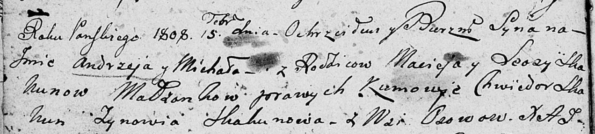

**Скакун Леоза (Skakunowa Leoza)**

15 февраля 1808 г -- крещение сына Андрея Михала (НИАБ 136-13-894, лист
64об, №8/1808-р (ориг)).

**НИАБ 136-13-894:** Лист 64об. **Метрическая запись №8/1808-р (ориг).**

Дедиловичская Покровская церковь. 15 февраля 1808 года. Метрическая
запись о крещении.

Skakun Andrzey Michał -- сын родителей с деревни Осовo.

Skakun Maciey -- отец.

Skakunowa Leosa -- мать.

Skakun Chwiedor -- кум.

Skakunowa Zynowija -- кума.

Jazgunowicz Antoni -- ксёндз.
