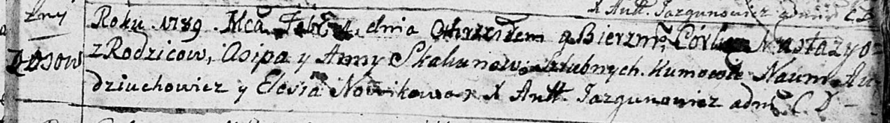
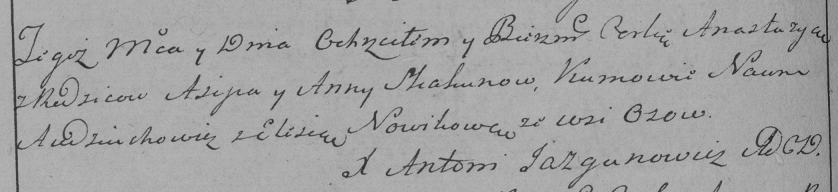
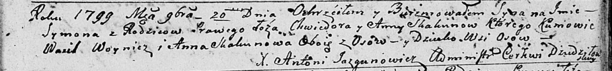

**Скакун Анна (Skakunowa Anna)**

4 февраля 1789 г -- крещение дочери Настасьи (НИАБ 136-13-894, лист 6,
№6/1789-р (ориг)), (РГИА 823-2-18, лист 237об, №5/1789-р (коп)).

20 ноября 1799 г -- возможно, крестная мать Сымона, сына Скакунов
Хведора и Анны с деревни Осово (НИАБ 136-13-894, лист 40, №48/1799-р
(коп)).

**НИАБ 136-13-894:** Лист 6. **Метрическая запись №6/1789-р (ориг).**

Дедиловичская Покровская церковь. 4 февраля 1789 года. Метрическая
запись о крещении.

Skakunowna Nastazya -- дочь родителей с деревни Осово.

Skakun Osip -- отец.

Skakunowa Anna -- мать.

Audziuchowicz Naum - кум.

Nowikowa Elesia - кума.

Jazgunowicz Antoni -- ксёндз.

**РГИА 823-2-18:** Лист 237об. **Метрическая запись №5/1789-р (коп).**

Дедиловичская Покровская церковь. 4 февраля 1789 года. Метрическая
запись о крещении.

Skakunowna Anastazya -- дочь родителей с деревни Осово.

Skakun Asip -- отец.

Skakunowa Anna -- мать.

Audziuchowicz Naum -- кум.

Nowikowa Elesia - кума.

Jazgunowicz Antoni -- ксёндз.

**НИАБ 136-13-894:** Лист 40. **Метрическая запись №48/1799-р (ориг).**

Дедиловичская Покровская церковь. 20 ноября 1799 года. Метрическая
запись о крещении.

Skakun Symon -- сын родителей с деревни Осовo.

Skakun Chwiedor -- отец.

Skakunowa Anna -- мать.

Woynicz Wasil -- кум, с деревни Осовo.

Skakunowa Anna -- кума, с деревни Осовo.

Jazgunowicz Antoni -- ксёндз.
