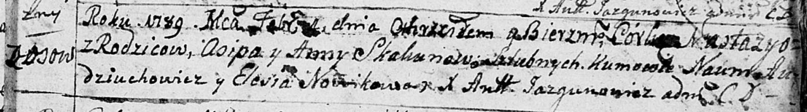

**Скакун Осип, Асип (Skakun Osip)**

4 февраля 1789 г -- крещение дочери Настасьи (НИАБ 136-13-894, лист 6,
№6/1789-р (ориг)), (РГИА 823-2-18, лист 237об, №5/1789-р (коп)).

8 апреля 1803 г -- крестный отец у Агафии Евдокии, дочери Скакунов
Владыслава и Прузыны с деревни Осово (НИАБ 136-13-894, лист 50,
№14/1803-р (ориг)).

**НИАБ 136-13-894:** Лист 6. **Метрическая запись №6/1789-р (ориг).**

Дедиловичская Покровская церковь. 4 февраля 1789 года. Метрическая
запись о крещении.

Skakunowna Nastazya -- дочь родителей с деревни Осово.

Skakun Osip -- отец.

Skakunowa Anna -- мать.

Audziuchowicz Naum - кум.

Nowikowa Elesia - кума.

Jazgunowicz Antoni -- ксёндз.

**РГИА 823-2-18:** Лист 237об. **Метрическая запись №5/1789-р (коп).**

Дедиловичская Покровская церковь. 4 февраля 1789 года. Метрическая
запись о крещении.

Skakunowna Anastazya -- дочь родителей с деревни Осово.

Skakun Asip -- отец.

Skakunowa Anna -- мать.

Audziuchowicz Naum -- кум.

Nowikowa Elesia - кума.

Jazgunowicz Antoni -- ксёндз.

**НИАБ 136-13-894:** Лист 50. **Метрическая запись №14/1803-р (ориг).**

Дедиловичская Покровская церковь. 8 апреля 1803 года. Метрическая запись
о крещении.

Skakunowna Ahaffia Ewdokia -- дочь родителей с деревни Осовo.

Skakun Władysław -- отец.

Skakunowa Pruzyna -- мать.

Skakun Asip -- кум, с деревни Осовo.

Woyniczowa Tekla -- кума, с деревни Осовo.

Jazgunowicz Antoni -- ксёндз.
