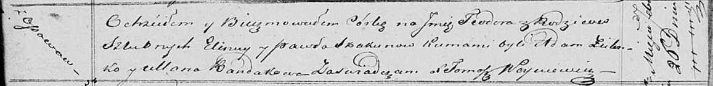

**Скакун Павел (Skakun Paweł)**

22 июля 1807 г -- крещение дочери Магдалены (НИАБ 136-13-893, лист 63,
№34/1807-р (ориг)).

26 февраля 1821 г -- крещение дочери Тодоры (НИАБ 136-13-893, лист 106,
№12/1821-р (ориг)).

**НИАБ 136-13-894:** Лист 63. **Метрическая запись №34/1807-р (ориг).**

Дедиловичская Покровская церковь. 22 июля 1807 года. Метрическая запись
о крещении.

Skakunowna Magdalena -- дочь родителей с деревни Осовo.

Skakun Paweł -- отец.

Skakunowa Elena -- мать.

Zielonka Mateusz -- кум.

Randakowa Ullana -- кума.

Jazgunowicz Antoni -- ксёндз.

**НИАБ 136-13-894:** Лист 106. **Метрическая запись №12/1821-р (ориг).**

Осовская Покровская церковь. 26 февраля 1821 года. Метрическая запись о
крещении.

Skakunowna Teodora -- дочь родителей с деревни Осовo.

Skakun Paweł -- отец.

Skakunowa Eliena -- мать.

Zielonko Adam -- кум.

Randakowa Ullana -- кума.

Woyniewicz Tomasz -- ксёндз.
