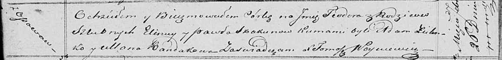

**Скакун Тодора Павлова (Skakunowna Teodora)**

26 февраля 1821 г -- крещение (НИАБ 136-13-893, лист 106, №12/1821-р
(ориг)).

**НИАБ 136-13-894:** Лист 106. **Метрическая запись №12/1821-р (ориг).**

{width="6.496527777777778in"
height="0.7918667979002625in"}

Осовская Покровская церковь. 26 февраля 1821 года. Метрическая запись о
крещении.

Skakunowna Teodora -- дочь родителей с деревни Осовo.

Skakun Paweł -- отец.

Skakunowa Eliena -- мать.

Zielonko Adam -- кум.

Randakowa Ullana -- кума.

Woyniewicz Tomasz -- ксёндз.
