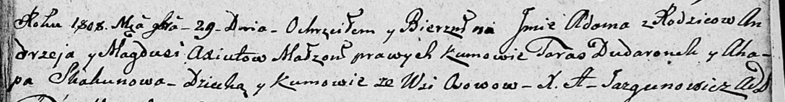

**Скакун Агафия (Skakunowa Ahafija)**

1 сентября 1789 г -- крещение дочери Натальи (НИАБ 136-13-893, лист 7об,
№43/1789-р (ориг))

10 мая 1803 г -- возможно, крестная мать Миколая Бенедыкта, сына Чапляев
Яна и Ксени с деревни Осово (НИАБ 136-13-894, лист 50об, №21/1803-р
(ориг)).

29 ноября 1808 г -- вероятно, крестная мать Адама, сына Аксют Андрея и
Магдуси с деревни Осово (НИАБ 136-13-894, лист 73, №45/1808-р (ориг)).

**НИАБ 136-13-894:** Лист 7об. **Метрическая запись №43/1789-р (ориг).**

{width="6.496527777777778in"
height="0.6302755905511811in"}

Дедиловичская Покровская церковь. 1 сентября 1789 года. Метрическая
запись о крещении.

Skakunowna Natalia -- дочь родителей с деревни Осово.

Skakun Prokop -- отец.

Skakunowa Ahafija -- мать.

Skakun Jan - кум.

Nowikowa Marta - кума.

Jazgunowicz Antoni -- ксёндз.

**НИАБ 136-13-894:** Лист 50об. **Метрическая запись №21/1803-р
(ориг).**

{width="6.496527777777778in"
height="1.4462806211723536in"}

Дедиловичская Покровская церковь. 10 мая 1803 года. Метрическая запись о
крещении.

Czaplay Mikołay Benedykt -- сын родителей с деревни Осовo.

Czaplaj Jan -- отец.

Czaplaiowa Xienia -- мать.

Kowal Sylwester -- кум, с деревни Осовo.

Skakunowa Ahafia -- кума, с деревни Осовo.

Jazgunowicz Antoni -- ксёндз.

**НИАБ 136-13-894:** Лист 73. **Метрическая запись №45/1808-р (ориг).**

{width="6.496527777777778in"
height="0.8522123797025372in"}

Дедиловичская Покровская церковь. 29 ноября 1808 года. Метрическая
запись о крещении.

Axiuta Adam -- сын родителей с деревни Осово.

Axiuta Andrzey -- отец.

Axiutowa Magdusia -- мать.

Dudaronek Taras -- кум, с деревни Осово.

Skakunowa Ahapa -- кума, с деревни Осово.

Jazgunowicz Antoni -- ксёндз.
