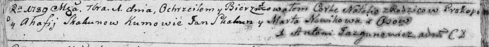

**Скакун Прокоп (Skakun Prokop)**

1 сентября 1789 г -- крещение дочери Натальи (НИАБ 136-13-893, лист 7об,
№43/1789-р (ориг))

**НИАБ 136-13-894:** Лист 7об. **Метрическая запись №43/1789-р (ориг).**

Дедиловичская Покровская церковь. 1 сентября 1789 года. Метрическая
запись о крещении.

Skakunowna Natalia -- дочь родителей с деревни Осово.

Skakun Prokop -- отец.

Skakunowa Ahafija -- мать.

Skakun Jan - кум.

Nowikowa Marta - кума.

Jazgunowicz Antoni -- ксёндз.
