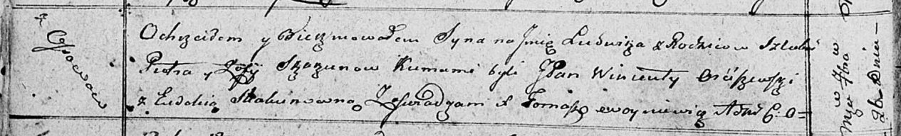

**Скакун Людвик Петров (Skakun Ludwik)**

26 сентября 1810 г -- крещение (НИАБ 136-13-893, лист 78об, №44/1810-р
(ориг)).

**НИАБ 136-13-894:** Лист 78об. **Метрическая запись №44/1810-р
(ориг).**

{width="6.496527777777778in"
height="0.9863134295713036in"}

Осовская Покровская церковь. 26 сентября 1810 года. Метрическая запись о
крещении.

Skakun Ludwik -- сын родителей с деревни Осовo.

Skakun Piotr -- отец.

Skakunowa Zofija -- мать.

Orćiszewski Wincenty, JP -- кум, шляхтич.

Skakunowna Ewdokija -- кума.

Woyniewicz Tomasz -- ксёндз.
