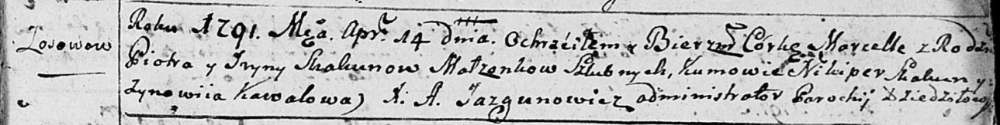
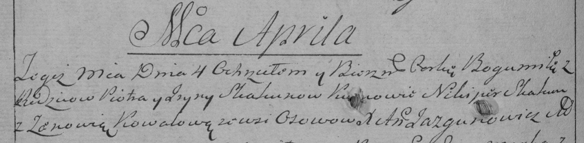

**Скакун Марцелла Петрова (Skakunowna Marcella)**

14 апреля 1791 г -- крещение дочери Марцеллы (НИАБ 136-13-893, лист 13,
№17/1791-р (ориг)), (РГИА 823-2-18, лист 241об, №8/1791-р (коп)).

**НИАБ 136-13-894:** Лист 13. **Метрическая запись №17/1791-р (ориг).**

Дедиловичская Покровская церковь. 14 апреля 1791 года. Метрическая
запись о крещении.

Skakunowna Marcella -- дочь родителей с деревни Осово.

Skakun Piotr -- отец.

Skakunowa Jryna -- мать.

Skakun Nikiper - кум.

Kowalowa Zynowija - кума.

Jazgunowicz Antoni -- ксёндз.

**РГИА 823-2-18:** Лист 241об. **Метрическая запись №8/1791-р (коп).**

Дедиловичская Покровская церковь. 4 апреля 1791 года. Метрическая запись
о крещении.

Skakunowna Bogumiła \[Marcella\] -- дочь родителей с деревни Осово.

Skakun Piotr -- отец.

Skakunowa Jryna -- мать.

Skakun Nikiper -- кум.

Kowalowa Zenowia - кума.

Jazgunowicz Antoni -- ксёндз.
