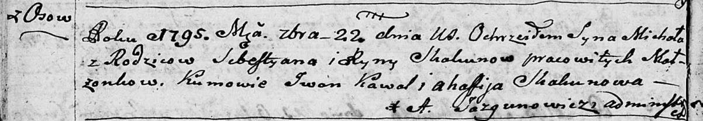

**Скакун Михал Себестыанов (Skakun Michał)**

22 сентября 1795 г -- крещение (НИАБ 136-13-893, лист 25об, №37/1795-р
(ориг), (РГИА 823-2-18, лист 253об, №30/1795-р (коп))

**НИАБ 136-13-894:** Лист 25об. **Метрическая запись №37/1795-р
(ориг).**

{width="6.496527777777778in"
height="1.1244378827646544in"}

Дедиловичская Покровская церковь. 22 сентября 1795 года. Метрическая
запись о крещении.

Skakun Michał -- сын селян с деревни Осовo.

Skakun Sebestyan -- отец.

Skakunowa Ryna -- мать.

Kawal Jwan - кум.

Skakunowa Ahafija - кума.

Jazgunowicz Antoni -- ксёндз.

**РГИА 823-2-18:** Лист 253об. **Метрическая запись №30/1795-р (коп).**

{width="6.496527777777778in"
height="1.5715277777777779in"}

Дедиловичская Покровская церковь. 22 сентября 1795 года. Метрическая
запись о крещении.

Skakun Michał -- сын родителей с деревни Осово.

Skakun Sebestyan -- отец.

Skakunowa Jryna -- мать.

Kowal Jwan -- кум.

Skakunowa Ahafia -- кума.

Jazgunowicz Antoni -- ксёндз.
