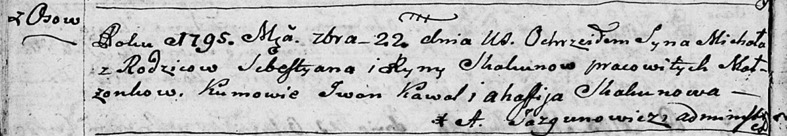
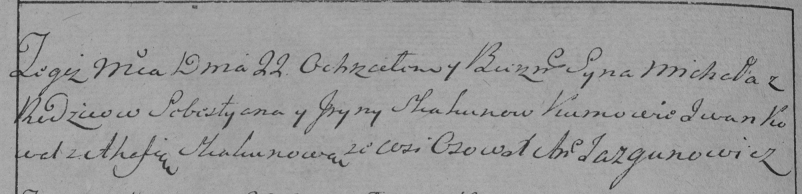
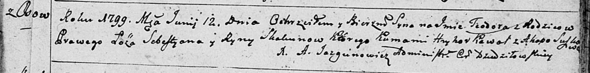
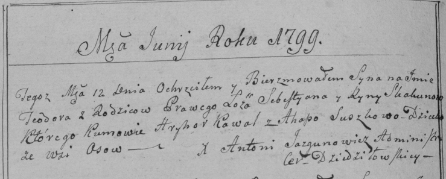
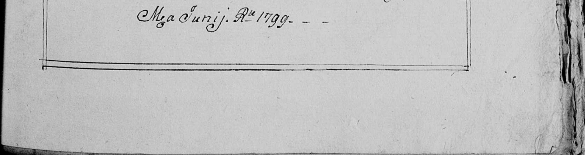
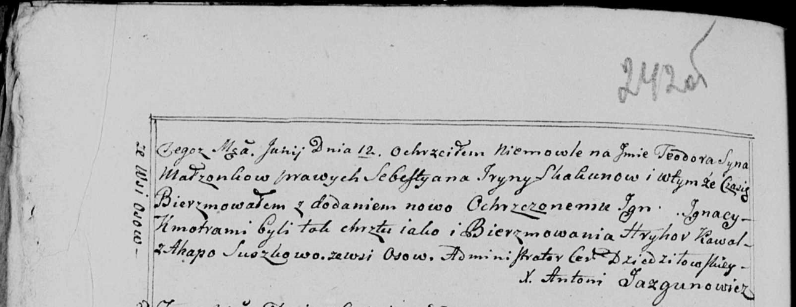

**Скакун Рына (Skakunowa Ryna)**

22 сентября 1795 г -- крещение сына Михала (НИАБ 136-13-893, лист 25об,
№37/1795-р (ориг), (РГИА 823-2-18, лист 253об, №30/1795-р (коп))

12 июня 1799 г -- крещение сына Тодора (НИАБ 136-13-893, лист 39,
№24/1799-р (ориг)), (РГИА 823-2-18, лист 270об, №24/1799-р (коп), НИАБ
136-13-938, лист 242-242об, №23/1799-р (коп)).

**НИАБ 136-13-894:** Лист 25об. **Метрическая запись №37/1795-р
(ориг).**

Дедиловичская Покровская церковь. 22 сентября 1795 года. Метрическая
запись о крещении.

Skakun Michał -- сын селян с деревни Осовo.

Skakun Sebestyan -- отец.

Skakunowa Ryna -- мать.

Kawal Jwan - кум.

Skakunowa Ahafija - кума.

Jazgunowicz Antoni -- ксёндз.

**РГИА 823-2-18:** Лист 253об. **Метрическая запись №30/1795-р (коп).**

Дедиловичская Покровская церковь. 22 сентября 1795 года. Метрическая
запись о крещении.

Skakun Michał -- сын родителей с деревни Осово.

Skakun Sebestyan -- отец.

Skakunowa Jryna -- мать.

Kowal Jwan -- кум.

Skakunowa Ahafia -- кума.

Jazgunowicz Antoni -- ксёндз.

**НИАБ 136-13-894:** Лист 39. **Метрическая запись №24/1799-р (ориг).**

Дедиловичская Покровская церковь. 12 июня 1799 года. Метрическая запись
о крещении.

Skakun Teodor -- сын родителей с деревни Осовo.

Skakun Sebestyan -- отец.

Skakunowa Ryna -- мать.

Kawal Hryhor-- кум.

Suszkowa Ahapa -- кума.

Jazgunowicz Antoni -- ксёндз.

**РГИА 823-2-18:** Лист 270об. **Метрическая запись №24/1799-р (коп).**

Дедиловичская Покровская церковь. 12 июня 1799 года. Метрическая запись
о крещении.

Skakun Teodor -- сын родителей с деревни Осово.

Skakun Sebestyan -- отец.

Skakunowa Ryna -- мать.

Kawal Hryhor -- кум.

Suszkowa Ahapa -- кума.

Jazgunowicz Antoni -- ксёндз.

**НИАБ 136-13-938:** Лист 242-242об. **Метрическая запись №23/1799-р
(коп).**

(См. тж. НИАБ 136-13-894, лист 39, №24/1799-р (ориг); РГИА 823-2-18,
лист 270об, №24/1799-р (коп))

Дедиловичская Покровская церковь. 12 июня 1799 года. Метрическая запись
о крещении.

Skakun Teodor Jgnacy -- сын родителей с деревни Осово.

Skakun Sebestyan -- отец.

Skakunowa Jryna -- мать.

Kawal Hryhor -- кум.

Suszkowa Ahapa - кума, с деревни Осово.

Jazgunowicz Antoni -- ксёндз.
