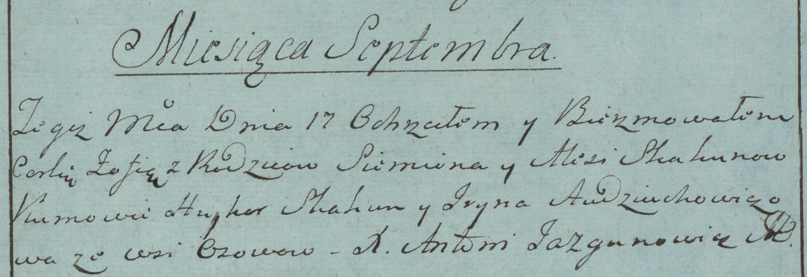

**Скакун Зофья Семёнова (Skakun Zofia)**

17 сентября 1783 г -- крещение (РГИА 823-2-18, лист 225, №23/1783-р
(коп)).

**РГИА 823-2-18:** Лист 225. **Метрическая запись №23/1783-р (коп).**

{width="6.496527777777778in"
height="2.234722222222222in"}

Дедиловичская Покровская церковь. 17 сентября 1783 года. Метрическая
запись о крещении.

Skakunowna Zofia -- дочь родителей с деревни Осово.

Skakun Siemion -- отец.

Skakunowa Alesia -- мать.

Skakun Hryhor -- кум.

Audziuchowiczowa Jryna - кума.

Jazgunowicz Antoni -- ксёндз.
