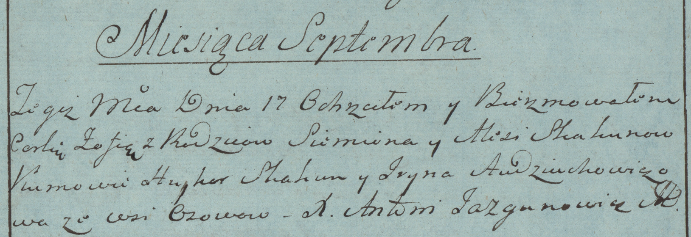
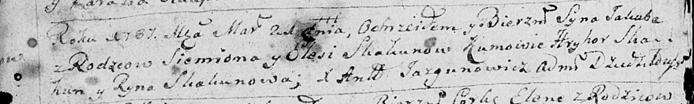

**Скакун Семён (Skakun Siemion)**

17 сентября 1783 г -- крещение дочери Зофьи (РГИА 823-2-18, лист 225,
№23/1783-р (коп)).

21 марта 1787 г -- крещение сына Якуба (НИАБ 136-13-893, лист 1об,
№10/1787-р (ориг))

**РГИА 823-2-18:** Лист 225. **Метрическая запись №23/1783-р (коп).**

Дедиловичская Покровская церковь. 17 сентября 1783 года. Метрическая
запись о крещении.

Skakunowna Zofia -- дочь родителей с деревни Осово.

Skakun Siemion -- отец.

Skakunowa Alesia -- мать.

Skakun Hryhor -- кум.

Audziuchowiczowa Jryna - кума.

Jazgunowicz Antoni -- ксёндз.

**НИАБ 136-13-894:** Лист 1об. **Метрическая запись** **№10/1787-р
(ориг).**

Дедиловичская Покровская церковь. 21 марта 1787 года. Метрическая запись
о крещении.

Skakun Jakub - сын родителей с деревни Осово.

Skakun Siemion -- отец.

Skakunowa Elesia -- мать.

Skakun Hryhor - кум.

Skakunowa Ryna - кума.

Jazgunowicz Antoniusz -- ксёндз.
