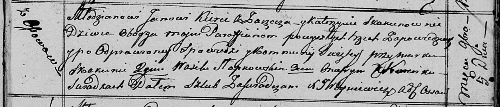

**Керко (в девичестве Скакун) Катерына (Kierkowa Katerzyna z Skakunow)**

5 ноября 1816 г -- венчание с молодым Яном Керко с деревни Заречье (НИАБ
136-13-920, лист 23, №8/1816-б (ориг)).

**НИАБ 136-13-920:** Лист 23. **Метрическая запись №8/1816-б (ориг).**

Осовская Покровская церковь. 5 ноября 1816 года. Запись о венчании.

Kierko Jan -- жених, молодой, парафии Осовской, с деревни Заречье.

Skakunowna Katerzyna -- невеста, девка, парафии Осовской, с деревни
Осово.

Skakun Markо -- свидетель.

Słapkowski Wasil -- свидетель.

Koreńko Onufry -- свидетель.

Woyniewicz Tomasz -- ксёндз.
