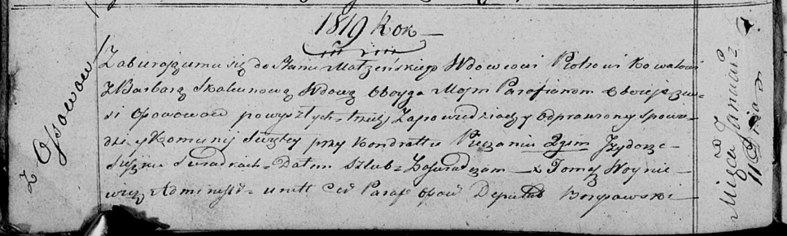

**Коваль (в предыдущем браке Скакун) Варвара (Kowalowa (Skakunowa)
Barbara)**

11 января 1819 г -- венчание с вдовцом Петром Ковалём с деревни Осово
(НИАБ 136-13-920, лист 25об, №1/1819-б (коп)).

**НИАБ 136-13-920:** Лист 25об. **Метрическая запись №1/1819-б (ориг).**

Осовская Покровская церковь. 11 января 1819 года. Запись о венчании.

Kowal Piotr -- жених, вдовец, парафии Осовской, с деревни Осово.

Skakunowa Barbara -- невеста, вдова, парафии Осовской, с деревни Осово.

Pieczań Kondrat -- свидетель.

Suszko Jzydor -- свидетель.

Woyniewicz Tomasz -- ксёндз.
