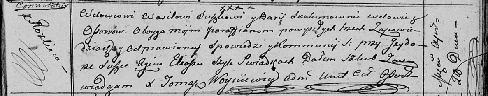

**Сушко (в предыдущем браке Скакун) Дарья (Suszkowa (Skakunowna)
Darja)**

28 апреля 1813 г -- венчание с вдовцом Василём Сушко с деревни Разлитье
(НИАБ 136-13-920, лист 19, №4/1813-б (ориг)).

**НИАБ 136-13-920:** Лист 19. **Метрическая запись №4/1813-б (ориг).**

Осовская Покровская церковь. 28 апреля 1813 года. Запись о венчании.

Suszko Wasil -- жених, вдовец, парафии Осовской, с деревни Разлитье.

Skakunowna Darija -- невеста, вдова, парафии Осовской, с деревни Осово.

Suszko Jzydor -- свидетель.

Szyło Eliasz -- свидетель.

Woyniewicz Tomasz -- ксёндз.
