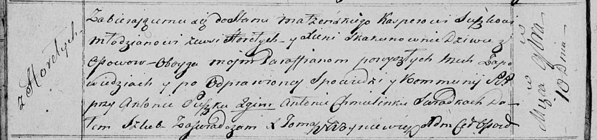

**Сушко (в девичестве Скакун) Ксеня (Suszkowa Xienia z Skakunow)**

10 ноября 1817 г -- венчание с молодым Каспером Сушко с деревни Горелое
(НИАБ 136-13-920, лист 24об, №11/1817-б (об)).

**НИАБ 136-13-920:** Лист 24об. **Метрическая запись №11/1817-б
(ориг).**

Осовская Покровская церковь. 10 ноября 1817 года. Запись о венчании.

Suszko Kasper -- жених, молодой, парафии Осовской, с деревни Горелое.

Skakunowna Xienia -- невеста, девка, парафии Осовской, с деревни Осово.

Suszko Antonij -- свидетель.

Chmielinko Antonij -- свидетель.

Woyniewicz Tomasz -- ксёндз.
