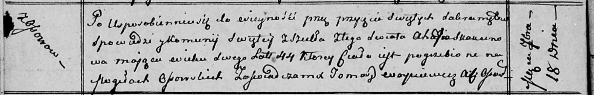

**Скакун Агапа (Skakunowa Ahapa)**

18 сентября 1812 г -- отпевание, умерла в возрасте 44 лет (родилась
около 1768 г) (НИАБ 136-13-919, лист 24об, №18/1812-у (ориг)).

**НИАБ 136-13-919:** Лист 24об. **Метрическая запись №18/1812-у
(ориг).**

{width="6.496527777777778in"
height="1.0416666666666667in"}

Осовская униатская церковь. 18 сентября 1812 года. Метрическая запись об
отпевании.

Skakunowa Ahapa -- умершая, 44 года, с деревни Осово, похоронена на
кладбище деревни Осово.

Woyniewicz Tomasz -- ксёндз.
