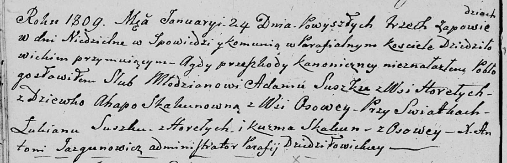

**Сушко (Скакун) Агата, Агапа (Suszkowa Agata, Ahapa z Skakunow)**

24 января 1809 г -- венчание с Адамом Сушко с деревни Горелое (НИАБ
136-13-920, лист 14об, №1/1809-б (ориг)).

**НИАБ 136-13-920:** Лист 14об. **Метрическая запись №1/1809-б (ориг).**

{width="6.496527777777778in"
height="2.097341426071741in"}

Дедиловичская Покровская церковь. 24 января 1809 года. Метрическая
запись о венчании.

Suszko Adam -- жених, с деревни Горелое.

Skakunowna Ahapa -- невеста, девка, с деревни Осовo.

Suszko Łukjan -- свидетель, с деревни Горелое.

Skakun Kuzma -- свидетель, с деревни Осовo.

Jazgunowicz Antoni -- ксёндз.
