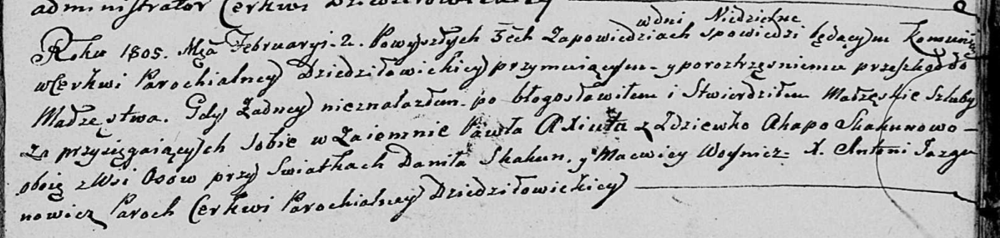

**Аксюта (Скакун) Агата (Axiutowa Agata, Ahafia z Skakunow)**

2 февраля 1805 г -- венчание с Павлом Аксютой с деревни Осово (НИАБ
136-13-920, лист 11, №1/1805-б (ориг)).

**НИАБ 136-13-920:** Лист 11. **Метрическая запись №1/1805-б (ориг).**

Дедиловичская Покровская церковь. 2 февраля 1805 года. Метрическая
запись о венчании.

Axiuta Paweł -- жених, с деревни Осовo.

Skakunowa Agata -- невеста, девка, с деревни Осовo.

Skakun Daniła -- свидетель.

Woynicz Macwiey -- свидетель.

Jazgunowicz Antoni -- ксёндз.
