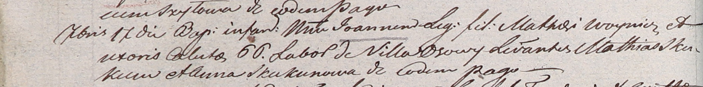

**Скакун Анна (Skakunowa Anna)**

17 мая 1801 г -- крестная мать Катарины, дочери Мацея и Калюхи Войничев
с деревни Осово (НИАБ 937-4-32, лист 4об, №10/1800-р).

17 сентября 1804 г -- крестная мать Катарины, дочери Мацея и Калюты
Войничев с деревни Осово (НИАБ 937-4-32, лист 10об, №21/1804-р).

**НИАБ 937-4-32:** Лист 4об. **Метрическая запись №10/1801-р.**

Дедиловичский костел Наисвятейшего Сердца Иисуса. 17 мая 1801 года.
Метрическая запись о крещении.

Woyniczowna Catharina -- дочь крестьян с деревни Осово.

Woynicz Mathias -- отец.

Woyniczowa Caluha \[Cecylia\] -- мать.

Skakun Mathias -- крестный отец, с деревни Осово.

Skakunowa Anna -- крестная мать, с деревни Осово.

Linhart Hyacinthus -- ксёндз.

**НИАБ 937-4-32:** Лист 10об. **Метрическая запись №21/1804-р.**

Дедиловичский костел Наисвятейшего Сердца Иисуса. 17 сентября 1804 года.
Метрическая запись о крещении.

Woynicz Joann -- сын крестьян с деревни Осово.

Woynicz Mathei -- отец.

Woyniczowa Caluto \[Cecilia\] -- мать.

Skakun Mathei -- крестный отец.

Skakunowa Anna -- крестная мать, с деревни Осово.

Galinowski Joann -- ксёндз, комендант Дедиловичского костела.
